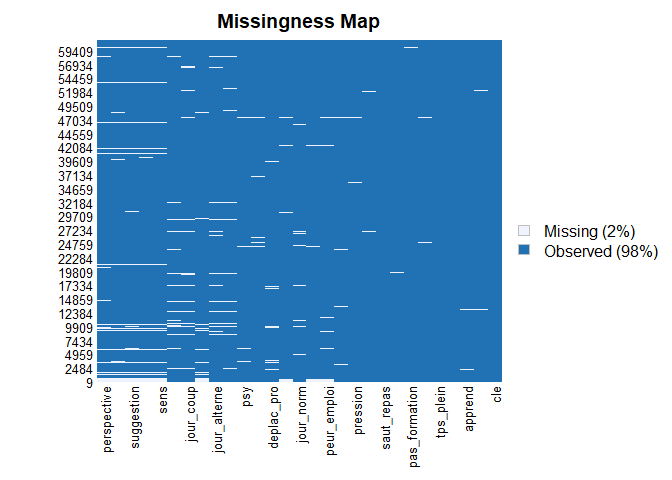

Analyse Factorielle Exploratoire (AFE)
================
Manal Derghal
2025-09-05

# Préparation de l’environnement de travail

Ce bloc de code permet de s’assurer que tous les packages R nécessaires
à l’analyse sont installés. Il vérifie leur présence et les installe si
besoin, en prenant en compte la possibilité d’utiliser un dépôt de
packages spécifique à EDF.

``` r
required_packages <- c("polycor","psych","haven","qgraph","EGAnet","Amelia","rgl")
# Fonction pour vérifier si un package est installé
is_package_installed <- function(package_name) {
  return(package_name %in% installed.packages()[, "Package"])
}

# Définir un dépôt personnalisé EDF si nécessaire
edf_repo <- "https://si-devops-mirror.edf.fr/repository/cran.r-project.org/"
# Demander à l'utilisateur s'il utilise un PC EDF
use_edf_repo <- tolower(readline("💻 Es-tu sur un PC EDF ? (oui/non) : ")) %in% c("oui", "o", "yes", "y")

# Installation des packages
for (pkg in required_packages) {
  if (!is_package_installed(pkg)) {
    

    message(paste("🔄 Installation de", pkg, "..."))
    if (use_edf_repo) {
      install.packages(pkg, repos = edf_repo)
    } else {
      install.packages(pkg)
    }
  } else {
    message(paste("✓", pkg, "déjà installé."))
  }
}
```

    ## ✓ polycor déjà installé.

    ## ✓ psych déjà installé.

    ## ✓ haven déjà installé.

    ## ✓ qgraph déjà installé.

    ## ✓ EGAnet déjà installé.

    ## ✓ Amelia déjà installé.

    ## ✓ rgl déjà installé.

``` r
cat("\n🎉 Tous les packages sont installés ou déjà présents. \n")
```

# Chargement des librairies

Ce code charge les librairies R nécessaires pour l’exécution des scripts
suivants, en supprimant les messages de démarrage pour une sortie plus
propre.

``` r
library(polycor)
library(psych)
library(dplyr)
library(qgraph)
library(Amelia)
library(EGAnet)
library(ggplot2)
```

# Préparation et nettoyage initial des données

Ce bloc de code charge les données depuis un fichier CSV, effectue un
tri aléatoire, puis conserve uniquement le bilan le plus récent pour
chaque individu (cle). Il supprime également les lignes contenant des
valeurs incorrectes pour la variable pcs.

``` r
# Chargement des données depuis le fichier CSV.
df <- read.csv("visites_6.csv", sep=";")

df <- as.data.frame(df)

colonnes <- c(
  'cle','date_bilan','sexe2','age3','pcs1','ct_plein','ct_j_normal','ct_j_coupure','ct_j_decale','ct_j_alterne','ct_j_nuit','ct_j_deplace',
  'ct_c_depasse','ct_c_repas','ct_c_rigueur','ct_c_pression','ct_a_apprend','ct_a_varie','ct_a_libre','ct_a_coop','ct_a_reconnu','ct_ex_psy','s_anxiete_plainte','s_fatigue_plainte','s_sommeil_plainte','ct_a_desapprouve','ct_a_emploi','ct_a_concilier',
  'ct_a_qualite','qc_ieg_perspective','qc_ieg_sens','qc_ieg_objectif','qc_ieg_suggestion','qc_ieg_ambiance','ct_c_aba_neg2','f_1an2'
)

# Sélection des colonnes
df <- df[, colonnes]

# Renommage des colonnes
nouvelles_colonnes <- c(
  'cle','date_bilan','sexe','age','pcs','tps_plein','jour_norm','jour_coup','jour_decale','jour_alterne','travail_nuit','deplac_pro',
  'depasse_horaire','saut_repas','trop_vite','pression','apprend','varie','libre','cooperation','reconnu','psy',
  's_anxiete_plainte','s_fatigue_plainte','s_sommeil_plainte','desapprouve','peur_emploi','concilier_vie',
  'qualite_travail','perspective','sens','objectif','suggestion','ambiance','taches_diff','pas_formation'
)

df <- setNames(df, nouvelles_colonnes)


# Trie de façon aléatoire les lignes du data frame 'df'
df <- df %>% sample_n(n())

# Tri par date de bilan pour conserver le plus récent pour chaque 'cle'.
df <- df %>%
  arrange(desc(date_bilan)) %>%
  distinct(cle, .keep_all = TRUE)

# Suppression des lignes avec des valeurs de 'pcs' incorrectes (1 et 2).
df <- df[!(df$pcs %in% c(1, 2)),]
```

``` r
dim(df)
```

    ## [1] 61284    36

``` r
head(df[, -1])
```

    ##   date_bilan sexe age pcs tps_plein jour_norm jour_coup jour_decale
    ## 1 2025-02-13    2   2   3         1         1         0           0
    ## 2 2025-02-13    2   2   3         1        NA         0           0
    ## 3 2025-02-13    2   3   3         1         1         1           0
    ## 4 2025-02-13    1   0   3         1         1         0           0
    ## 5 2025-02-13    2   0   3         1         1         0           0
    ## 6 2025-02-13    2   3   3         1         1         0           0
    ##   jour_alterne travail_nuit deplac_pro depasse_horaire saut_repas trop_vite
    ## 1            0            0          0               2          1         2
    ## 2            0            0          0               1          1         1
    ## 3            0            0          0               1          0         0
    ## 4            0            0          0               1          0         0
    ## 5            0            0          0               1          2         3
    ## 6            0            0          0               3          1         1
    ##   pression apprend varie libre cooperation reconnu psy s_anxiete_plainte
    ## 1        8       2     1     3           2       2   0                NA
    ## 2        8       3     3     2           3       3   0                NA
    ## 3        7       3     3     2           2       2   0                 0
    ## 4        3       3     3     3           3       3   0                 0
    ## 5        7       3     2     2           3       3   0                 0
    ## 6        8       2     3     3           2       3   0                 0
    ##   s_fatigue_plainte s_sommeil_plainte desapprouve peur_emploi concilier_vie
    ## 1                NA                NA           0           0             2
    ## 2                NA                NA           1           0             2
    ## 3                 0                 0           1           0             3
    ## 4                 0                 0           0           0             2
    ## 5                 0                 1           1           0             1
    ## 6                 0                 0           0           0             2
    ##   qualite_travail perspective sens objectif suggestion ambiance taches_diff
    ## 1               2           2    1        3          3        7           1
    ## 2               3          NA   NA       NA         NA       NA           1
    ## 3               2           2    3        2          2        5           1
    ## 4               3           2    3        3          3       10           0
    ## 5               1           3    3        1          3        9           0
    ## 6               2           3    2        3          3        8           1
    ##   pas_formation
    ## 1             0
    ## 2             1
    ## 3             1
    ## 4             0
    ## 5             1
    ## 6             0

# Sélection des items pour l’analyse factorielle

Ici, nous définissons et créons un nouveau jeu de données (df_items) qui
contient uniquement les variables pertinentes pour l’analyse
factorielle, en excluant les variables démographiques et certaines
plaintes.

``` r
# Définit les items (colonnes) à exclure de l'analyse.
items_to_drop <- c(
  'date_bilan',
  'age',
  'sexe',
  'pcs',
  's_anxiete_plainte',
  's_fatigue_plainte',
  's_sommeil_plainte'
)

# Crée un nouveau data frame avec uniquement les items à analyser.
df_items <- df[, !(names(df) %in% items_to_drop), drop = FALSE]

# Affiche le nombre d'items sélectionnés.
cat(paste("Sélection de", length(df_items), "items pour l'analyse.\n"))
```

    ## Sélection de 29 items pour l'analyse.

``` r
head(df_items[,-1])
```

    ##   tps_plein jour_norm jour_coup jour_decale jour_alterne travail_nuit
    ## 1         1         1         0           0            0            0
    ## 2         1        NA         0           0            0            0
    ## 3         1         1         1           0            0            0
    ## 4         1         1         0           0            0            0
    ## 5         1         1         0           0            0            0
    ## 6         1         1         0           0            0            0
    ##   deplac_pro depasse_horaire saut_repas trop_vite pression apprend varie libre
    ## 1          0               2          1         2        8       2     1     3
    ## 2          0               1          1         1        8       3     3     2
    ## 3          0               1          0         0        7       3     3     2
    ## 4          0               1          0         0        3       3     3     3
    ## 5          0               1          2         3        7       3     2     2
    ## 6          0               3          1         1        8       2     3     3
    ##   cooperation reconnu psy desapprouve peur_emploi concilier_vie qualite_travail
    ## 1           2       2   0           0           0             2               2
    ## 2           3       3   0           1           0             2               3
    ## 3           2       2   0           1           0             3               2
    ## 4           3       3   0           0           0             2               3
    ## 5           3       3   0           1           0             1               1
    ## 6           2       3   0           0           0             2               2
    ##   perspective sens objectif suggestion ambiance taches_diff pas_formation
    ## 1           2    1        3          3        7           1             0
    ## 2          NA   NA       NA         NA       NA           1             1
    ## 3           2    3        2          2        5           1             1
    ## 4           2    3        3          3       10           0             0
    ## 5           3    3        1          3        9           0             1
    ## 6           3    2        3          3        8           1             0

# Recodage et transformation des variables

Ce bloc de code effectue des transformations importantes sur les
données, notamment l’inversion de l’échelle de certaines variables
ordinales et la discrétisation de variables continues en utilisant des
quantiles.

``` r
# Variables ordinales 0-1 à inverser (0->1, 1->0)
# Définit les variables dont les scores de 0 et 1 doivent être inversés.
variables_ordinales_0_1_a_inverser <- c('tps_plein', 'jour_norm')

# Applique l'inversion à chaque colonne de la liste.
for (col in variables_ordinales_0_1_a_inverser) {
  df[[col]] <- 1 - df[[col]]
}
cat("Variables ordinales 0-1 inversées :", paste(variables_ordinales_0_1_a_inverser, collapse = ", "), "\n")
```

    ## Variables ordinales 0-1 inversées : tps_plein, jour_norm

``` r
# Variables ordinales 0-3 à inverser (0->3, 1->2, 2->1, 3->0)
# Définit les variables dont les scores de 0 à 3 doivent être inversés.
variables_ordinales_0_3_a_inverser <- c(
    'apprend', 'varie', 'libre', 'cooperation', 'reconnu',
    'concilier_vie', 'qualite_travail', 'perspective', 'sens',
    'objectif', 'suggestion'
)

# Applique l'inversion à chaque colonne de la liste.
for (col in variables_ordinales_0_3_a_inverser) {
  df[[col]] <- 3 - df[[col]]
}
cat("Variables ordinales 0-3 inversées :", paste(variables_ordinales_0_3_a_inverser, collapse = ", "), "\n")
```

    ## Variables ordinales 0-3 inversées : apprend, varie, libre, cooperation, reconnu, concilier_vie, qualite_travail, perspective, sens, objectif, suggestion

``` r
# Transformation de 'ct_c_pression' en variable ordinale.
# Calcule les quantiles pour définir les points de coupe.
quantile_breaks_pression <- quantile(df_items$pression,
                                     probs = c(0, 0.25, 0.5, 0.75, 1),
                                     na.rm = TRUE)
unique_breaks_pression <- unique(quantile_breaks_pression)

# Affiche les points de coupe.
cat("Points de coupe pour 'pression' basés sur les quantiles (Min, Q1, Med, Q3, Max) :\n")
```

    ## Points de coupe pour 'pression' basés sur les quantiles (Min, Q1, Med, Q3, Max) :

``` r
print(unique_breaks_pression)
```

    ## [1]  0  3  5  7 10

``` r
# Discrétise la variable 'pression' en utilisant les quantiles.
df_items$pression <- cut(df_items$pression,
                              breaks = unique_breaks_pression,
                              include.lowest = TRUE,
                              labels = FALSE)


# Transformation de 'qc_ieg_ambiance' en variable ordinale.
# Calcule les quantiles pour définir les points de coupe.
quantile_breaks_ambiance <- quantile(df_items$ambiance,
                                     probs = c(0, 0.25, 0.5, 0.75, 1),
                                     na.rm = TRUE)
unique_breaks_ambiance <- unique(quantile_breaks_ambiance)

# Affiche les points de coupe.
cat("Points de coupe pour 'ambiance' basés sur les quantiles (Min, Q1, Med, Q3, Max) :\n")
```

    ## Points de coupe pour 'ambiance' basés sur les quantiles (Min, Q1, Med, Q3, Max) :

``` r
print(unique_breaks_ambiance)
```

    ## [1]  0  6  7  8 10

``` r
# Discrétise la variable 'ambiance' en utilisant les quantiles.
df_items$ambiance <- cut(df_items$ambiance,
                                breaks = unique_breaks_ambiance,
                                include.lowest = TRUE,
                                labels = FALSE)
```

# Comparaison des corrélations de Pearson et Polychoriques

Ce code compare les matrices de corrélation de Pearson (inadaptée pour
les données ordinales) et polychorique (plus appropriée) afin de montrer
l’importance d’utiliser la bonne méthode.

``` r
# Sélectionne les 10 premières variables pour l'analyse.
features = df_items[10:20]
features <- na.omit(features)

# Calcule la corrélation de Pearson, qui traite les données comme continues.
pear_cor = cor(features)

# Trace la matrice de corrélation de Pearson.
cor.plot(pear_cor, numbers=T, upper=FALSE,  main = "Pearson Correlation", show.legend = FALSE)
```

<!-- -->

``` r
# Calcule la corrélation polychorique, mieux adaptée aux données ordinales.
poly_cor = auto.correlate(features)

# Trace la matrice de corrélation polychorique.
cor.plot(poly_cor, numbers=T, upper=FALSE, main = "Polychoric Correlation", show.legend = FALSE)
```

<!-- -->

``` r
# Calcule la différence absolue entre les deux matrices pour montrer la distorsion.
diff_abs = abs(poly_cor - pear_cor)

png("Images/polychoric_vs_pearson.png", width = 2000, height = 1500, res = 300, units = "px")
# Trace la matrice de la différence pour visualiser l'ampleur de l'écart.
cor.plot(diff_abs, numbers = T, upper = FALSE, diag = FALSE, main = "Valeur absolue de la différence")
dev.off()
```

    ## png 
    ##   2

``` r
cor.plot(diff_abs, numbers = T, upper = FALSE, diag = FALSE, main = "Valeur absolue de la différence")
```

<!-- -->

# Visualisation des valeurs manquantes

Ce bloc de code génère une carte des valeurs manquantes (missmap) pour
le jeu de données final, ce qui permet de visualiser la distribution des
NA.

``` r
# Démarre l'enregistrement d'un graphique dans un fichier PNG.
png("Images/missingnessmap.png", width = 2100, height = 1500, res = 300)

# Affiche le titre "Missing map:".
cat("Missing map:\n")
```

    ## Missing map:

``` r
# Crée et affiche la carte des données manquantes pour le data frame 'df_items'.
missmap(df_items)

# Ferme le périphérique graphique et enregistre le fichier.
dev.off()
```

    ## png 
    ##   2

``` r
missmap(df_items)
```

<!-- -->

# Analyse visuelle des corrélations : qgraph

Le qgraph permet de visualiser la structure de corrélation entre les
variables, en mettant en évidence les liens forts et faibles. Ce bloc de
code génère ce graphique et affiche également les corrélations les plus
fortes (\> 0.8).

``` r
# Suppression des lignes NA
df_items <- na.omit(df_items)

#enlever la cle
df_items2 <- df_items[,-c(1)]

# Calcule la matrice de corrélation polychorique pour les variables.
poly_matrix <- auto.correlate(df_items2)

# Démarre l'enregistrement d'un graphique dans un fichier PNG.
png("Images/qgraph.png", width = 800, height = 600, res = 100)

# Crée et customise le graphique de corrélation (qgraph).
# Les paramètres ajustent l'affichage des arêtes (corrélations), des couleurs,
# et la taille des labels et des nœuds.
qgraph(poly_matrix,
       cut = .30,
       minimum = .30,
       details = TRUE,
       labels = names(df_items2),
       label.font = 2,
       label.cex = 1.5,
       vsize = 7
)

# Ferme le périphérique graphique et enregistre le fichier.
dev.off()
```

    ## png 
    ##   2

``` r
# Définit un seuil pour l'affichage des corrélations fortes.
correlation_threshold <- 0.8

cat(paste("\n--- Corrélations Polychoriques >", correlation_threshold, " (valeur absolue) ---\n"))
```

    ## 
    ## --- Corrélations Polychoriques > 0.8  (valeur absolue) ---

``` r
# Parcours la matrice de corrélation pour trouver et afficher les paires
# de variables dont la corrélation (en valeur absolue) dépasse le seuil.
var_names <- colnames(poly_matrix)
n_vars <- ncol(poly_matrix)

for (i in 1:(n_vars - 1)) {
  for (j in (i + 1):n_vars) {
    correlation_value <- poly_matrix[i, j]
    if (abs(correlation_value) > correlation_threshold) {
      cat(sprintf("Corrélation entre %s et %s : %.3f\n",
                  var_names[i], var_names[j], correlation_value))
    }
  }
}
```

    ## Corrélation entre jour_decale et jour_alterne : 0.874
    ## Corrélation entre jour_decale et travail_nuit : 0.852
    ## Corrélation entre jour_alterne et travail_nuit : 0.887

``` r
qgraph(poly_matrix,
       cut = .30,
       minimum = .30,
       details = TRUE,
       labels = names(df_items2),
       label.font = 2,
       label.cex = 1.5,
       vsize = 7
)
```

<!-- -->

``` r
dim(df_items)
```

    ## [1] 50652    29

Suite à l’inspection du qgraph, les variables travail_nuit et
jour_decale sont supprimées pour éviter des problèmes de colinéarité.

``` r
# Suppression des colonnes 'travail_nuit' et 'jour_decale' car elles sont trop corrélées.
df_items <- df_items[,!(names(df_items) %in% c('travail_nuit','jour_decale'))]
```

# Nettoyage des données : variance et valeurs manquantes

Ce bloc de code définit et exécute une fonction pour nettoyer les
données en supprimant les variables qui ont une variance trop faible.

``` r
# Fonction pour nettoyer les données en fonction de la variance et des valeurs manquantes.
clean_data <- function(df_input) {
  
  # Affiche les variances des variables.
  cat("Variance par variable :\n")
  variances <- sapply(df_input, var, na.rm = TRUE)
  print(sort(variances, decreasing = FALSE))

  # Supprime les variables avec une variance faible (seuil : 0.15).
  low_var_threshold <- 0.15
  low_var_items <- names(variances[variances < low_var_threshold])
  if (length(low_var_items) > 0) {
    df_output <- df_input[, !(names(df_input) %in% low_var_items)]
    cat(paste("Variables supprimées pour faible variance (<", low_var_threshold, "):", paste(low_var_items, collapse=", "), "\n"))
  } else {
    df_output <- df_input
    cat(paste("Aucune variable supprimée pour faible variance (<", low_var_threshold, ").\n"))
  }
  return(df_output)
}

# Créez une copie de votre data frame pour ne travailler que sur les colonnes à nettoyer
df_to_clean <- df_items[, -1]

# Appliquez la fonction 'clean_data' à cette copie
df_cleaned <- clean_data(df_to_clean)
```

    ## Variance par variable :
    ##       jour_coup       tps_plein       jour_norm    jour_alterne      deplac_pro 
    ##      0.06248344      0.06831927      0.08085287      0.13721377      0.14607646 
    ##             psy   pas_formation     taches_diff     peur_emploi qualite_travail 
    ##      0.18064207      0.19256933      0.24488021      0.31821390      0.39702462 
    ##   concilier_vie     cooperation         apprend        objectif     desapprouve 
    ##      0.42013959      0.43692144      0.46824183      0.47578769      0.47639117 
    ##           varie            sens         reconnu      suggestion           libre 
    ##      0.47676515      0.47875431      0.53967008      0.55760204      0.62487740 
    ##      saut_repas       trop_vite depasse_horaire     perspective        pression 
    ##      0.64188256      0.66208703      0.70832444      0.76352448      1.05813421 
    ##        ambiance 
    ##      1.24968513 
    ## Variables supprimées pour faible variance (< 0.15 ): tps_plein, jour_norm, jour_coup, jour_alterne, deplac_pro

``` r
# data frame nettoyé en ajoutant la colonne de clé (la première colonne)
df_items <- cbind(df_items[, 1], df_cleaned)
colnames(df_items)[1] <- "cle"
```

# Suppression de variables supplémentaires

Certaines variables sont manuellement retirées car elles ne s’intègrent
pas bien dans le modèle factoriel (communalités basses / cross-loadings)

``` r
items_to_drop <- c(
  'pas_formation',
  'peur_emploi',
  'desapprouve',
  'qualite_travail',
  'libre',
  'concilier_vie',
  'objectif',
  'saut_repas'
)

# Crée un nouveau data frame sans les variables exclues.
df_items_removed <- df_items[, !(names(df_items) %in% items_to_drop), drop = FALSE]

# Affiche le nombre d'items restants.
cat(paste("Sélection de", length(df_items_removed)-1, "items pour l'analyse.\n"))
```

    ## Sélection de 13 items pour l'analyse.

# Nouvel aperçu du qgraph après nettoyage

Après le nettoyage des variables, un nouveau qgraph est généré pour
confirmer l’impact des suppressions sur la structure de corrélation.

``` r
df_items2 <- df_items_removed[,-1]

# Calcule la matrice de corrélation polychorique pour les variables.
poly_matrix <- auto.correlate(df_items2)

# Démarre l'enregistrement d'un graphique dans un fichier PNG.
png("Images/qgraph2.png", width = 800, height = 600, res = 100)

# Crée et customise le graphique de corrélation (qgraph).
# Les paramètres ajustent l'affichage des arêtes (corrélations), des couleurs,
# et la taille des labels et des nœuds.
qgraph(poly_matrix,
       cut = .30,
       minimum = .30,
       details = TRUE,
       posCOL = "darkgreen",
       negCOL = "red",
       labels = names(df_items2),
       label.font = 2,
       label.cex = 1.5,
       vsize = 7
)
```

    ## Warning in qgraph(poly_matrix, cut = 0.3, minimum = 0.3, details = TRUE, : The
    ## following arguments are not documented and likely not arguments of qgraph and
    ## thus ignored: posCOL; negCOL

``` r
# Ferme le périphérique graphique et enregistre le fichier.
dev.off()
```

    ## png 
    ##   2

``` r
qgraph(poly_matrix,
       cut = .30,
       minimum = .30,
       details = TRUE,
       posCOL = "darkgreen",
       negCOL = "red",
       labels = names(df_items2),
       label.font = 2,
       label.cex = 1.5,
       vsize = 7
)
```

    ## Warning in qgraph(poly_matrix, cut = 0.3, minimum = 0.3, details = TRUE, : The
    ## following arguments are not documented and likely not arguments of qgraph and
    ## thus ignored: posCOL; negCOL

<!-- -->

# Évaluation de la faisabilité de l’AFE

Avant de lancer l’analyse factorielle, il faut vérifier si les données
sont adaptées. Ce bloc de code effectue les tests de KMO et de
sphéricité de Bartlett, et affiche le déterminant de la matrice de
corrélation.

``` r
# Fonction pour évaluer la faisabilité d'une analyse factorielle exploratoire (AFE).
perform_efa_feasibility <- function(df_input) {

  # Calcule la matrice de corrélations polychoriques entre les variables.
  poly_matrix <- auto.correlate(df_input)

  # Effectue le test KMO pour mesurer l'adéquation de l'échantillonnage pour l'AFE.
  cat("\nTest KMO :\n")
  kmo_result <- KMO(poly_matrix)
  print(kmo_result)
  if (kmo_result$MSA >= 0.7) {
    cat(" KMO global > 0.7, l'adéquation est bonne.\n")
  } else if (kmo_result$MSA >= 0.6) {
    cat(" KMO global entre 0.6 et 0.7, l'adéquation est acceptable.\n")
  } else {
    warning("KMO global < 0.6, la faisabilité de l'AFE est discutable.")
  }

  # Effectue le test de sphéricité de Bartlett pour vérifier si les variables sont corrélées.
  cat("\nTest de Bartlett :\n")
  n_obs <- nrow(df_input)
  bartlett_result <- cortest.bartlett(poly_matrix, n = n_obs)
  print(bartlett_result)
  if (bartlett_result$p.value < 0.05) {
    cat("Test de Bartlett significatif (p < 0.05), les données sont corrélées.\n")
  } else {
    warning("Test de Bartlett non significatif (p >= 0.05), les variables ne semblent pas assez corrélées pour une AFE.")
  }

  # Affiche le déterminant de la matrice de corrélation
  cat("\nDéterminant : \n")
  print(det(poly_matrix))

  return(poly_matrix)
}

poly_matrix <- perform_efa_feasibility(df_items2)
```

    ## 
    ## Test KMO :
    ## Kaiser-Meyer-Olkin factor adequacy
    ## Call: KMO(r = poly_matrix)
    ## Overall MSA =  0.89
    ## MSA for each item = 
    ## depasse_horaire       trop_vite        pression         apprend           varie 
    ##            0.84            0.85            0.86            0.84            0.83 
    ##     cooperation         reconnu             psy     perspective            sens 
    ##            0.93            0.93            0.91            0.92            0.90 
    ##      suggestion        ambiance     taches_diff 
    ##            0.92            0.93            0.85 
    ##  KMO global > 0.7, l'adéquation est bonne.
    ## 
    ## Test de Bartlett :
    ## $chisq
    ## [1] 288741.6
    ## 
    ## $p.value
    ## [1] 0
    ## 
    ## $df
    ## [1] 78
    ## 
    ## Test de Bartlett significatif (p < 0.05), les données sont corrélées.
    ## 
    ## Déterminant : 
    ## [1] 0.003341982

# Détermination du nombre de facteurs

Cette étape utilise le Scree Plot (pour identifier le “coude”) .

``` r
# Fonction pour déterminer le nombre de facteurs à retenir pour l'AFE.
determine_n_factors <- function(poly_matrix) {
  
  # Démarre l'enregistrement du Scree Plot dans un fichier PNG.
  output_filename_scree_parallel <- paste0("images/scree_analysis", ".png")
  png(output_filename_scree_parallel, width = 2000, height = 1500, res = 300, units = "px")
  
  # Génère un Scree Plot pour visualiser les valeurs propres et trouver le "coude".
  cat("Génération du Scree Plot (basé sur la matrice polychorique)...\n")
  scree(poly_matrix, factors = FALSE, pc = TRUE, hline = "-1", main = paste(""))
  
  # Ferme le périphérique graphique et enregistre le fichier.
  dev.off()
  
  scree(poly_matrix, factors = FALSE, pc = TRUE, hline = "-1", main = paste(""))

}

determine_n_factors(poly_matrix)
```

    ## Génération du Scree Plot (basé sur la matrice polychorique)...

<!-- -->

``` r
head(df_items2)
```

    ##   depasse_horaire trop_vite pression apprend varie cooperation reconnu psy
    ## 1               2         2        4       2     1           2       2   0
    ## 3               1         0        3       3     3           2       2   0
    ## 4               1         0        1       3     3           3       3   0
    ## 5               1         3        3       3     2           3       3   0
    ## 6               3         1        4       2     3           2       3   0
    ## 7               2         1        2       3     3           3       3   1
    ##   perspective sens suggestion ambiance taches_diff
    ## 1           2    1          3        2           1
    ## 3           2    3          2        1           1
    ## 4           2    3          3        4           0
    ## 5           3    3          3        4           0
    ## 6           3    2          3        3           1
    ## 7           2    2          2        3           0

# Exécution de l’Analyse Factorielle Exploratoire (AFE)

Ce bloc de code exécute l’AFE en utilisant la matrice de corrélation
polychorique. Il utilise la méthode d’extraction pa (Principle Axis
Factoring) et une rotation oblique promax, qui est appropriée lorsque
l’on s’attend à ce que les facteurs soient corrélés. Il génère aussi des
graphiques des résidus et des diagrammes de facteurs.

``` r
# Fonction pour exécuter l'Analyse Factorielle Exploratoire (AFE).
perform_efa <- function(poly_matrix, df_raw_data, n_obs, n_factors) {

  # Exécute l'AFE en utilisant la matrice de corrélation polychorique.
  # Les paramètres spécifient le nombre de facteurs, la méthode d'extraction (pa)
  # et la rotation oblique (promax).
  efa_model <- fa(
    r = poly_matrix,
    nfactors = n_factors,
    n.obs = n_obs,
    rotate = "varimax",
    fm = "pa",
    residuals = T,
    SMC=T,
    warnings=T
    )

  # Affiche les saturations (loadings) des variables sur les facteurs.
  cat(paste("Résultats de l'AFE :\n"))
  print.psych(efa_model, cut = 0.3, sort = TRUE)

  # Affiche la matrice de corrélation entre les facteurs (Phi matrix).
  # Cela n'est pertinent que pour une rotation oblique.
  cat(paste("\nCorrélations entre les facteurs (Phi matrix):\n"))
  if (!is.null(efa_model$Phi)) {
    print(round(efa_model$Phi, 2))
  } else {
    cat("Note: La rotation Varimax suppose des facteurs non corrélés. La matrice Phi n'est pas informative.\n")
  }

  resd = residuals(efa_model, diag = FALSE, na.rm = TRUE)
  print(resd)
  # Enregistre l'histogramme des résidus dans un fichier PNG.
  png("Images/residuals.png", width = 2000, height = 1500, res = 300, units = "px")
  hist(resd, 
       col = "red", 
       main = "Résidus",
       xlab = "Valeurs des résidus",
       cex.main = 2,
       cex.lab = 1.5,
       cex.axis = 1.5
  )
  dev.off()
  hist(resd, col = "red", main = paste("Residuals", xlab = "Residuals"))
  
  # Crée et enregistre le diagramme des facteurs dans un fichier PDF.
  pdf("Images/fadiagram.pdf", height=10, width=20)
  fa.diagram(efa_model,
              sort = TRUE,
              digits = 2,
              main = "",
              cut = 0.20
  )
  dev.off()
  fa.diagram(efa_model,
              sort = TRUE,
              digits = 2,
              main = "",
              cut = 0.20
  )

  # Retourne l'objet modèle complet.
  return(efa_model)
}

# Définit le nombre de facteurs choisis pour l'analyse.
n_factors_chosen <- 2

cat(paste("\n==> Nombre de facteurs CHOISI :", n_factors_chosen, "\n"))
```

    ## 
    ## ==> Nombre de facteurs CHOISI : 2

``` r
# Calcule la matrice de corrélations polychoriques à partir des données.
poly_matrix <- auto.correlate(df_items2)

# Exécute la fonction d'AFE avec les paramètres choisis et stocke le résultat.
efa_model <- perform_efa(poly_matrix, df_items2, nrow(df_items2), n_factors_chosen)
```

    ## Résultats de l'AFE :
    ## Factor Analysis using method =  pa
    ## Call: fa(r = poly_matrix, nfactors = n_factors, n.obs = n_obs, rotate = "varimax", 
    ##     residuals = T, SMC = T, warnings = T, fm = "pa")
    ## Standardized loadings (pattern matrix) based upon correlation matrix
    ##                 item   PA1   PA2   h2   u2 com
    ## sens              10  0.80       0.64 0.36 1.0
    ## apprend            4  0.76       0.59 0.41 1.0
    ## varie              5  0.73       0.57 0.43 1.2
    ## reconnu            7  0.71       0.53 0.47 1.1
    ## perspective        9  0.69       0.48 0.52 1.0
    ## suggestion        11  0.65       0.46 0.54 1.2
    ## cooperation        6  0.59 -0.32 0.45 0.55 1.5
    ## ambiance          12  0.59       0.42 0.58 1.4
    ## pression           3        0.74 0.57 0.43 1.1
    ## trop_vite          2        0.73 0.55 0.45 1.0
    ## taches_diff       13        0.73 0.54 0.46 1.0
    ## depasse_horaire    1        0.59 0.38 0.62 1.2
    ## psy                8 -0.30  0.55 0.39 0.61 1.5
    ## 
    ##                        PA1  PA2
    ## SS loadings           4.01 2.57
    ## Proportion Var        0.31 0.20
    ## Cumulative Var        0.31 0.51
    ## Proportion Explained  0.61 0.39
    ## Cumulative Proportion 0.61 1.00
    ## 
    ## Mean item complexity =  1.2
    ## Test of the hypothesis that 2 factors are sufficient.
    ## 
    ## df null model =  78  with the objective function =  5.7 with Chi Square =  288741.6
    ## df of  the model are 53  and the objective function was  0.44 
    ## 
    ## The root mean square of the residuals (RMSR) is  0.04 
    ## The df corrected root mean square of the residuals is  0.05 
    ## 
    ## The harmonic n.obs is  50652 with the empirical chi square  10928.92  with prob <  0 
    ## The total n.obs was  50652  with Likelihood Chi Square =  22171.51  with prob <  0 
    ## 
    ## Tucker Lewis Index of factoring reliability =  0.887
    ## RMSEA index =  0.091  and the 90 % confidence intervals are  0.09 0.092
    ## BIC =  21597.38
    ## Fit based upon off diagonal values = 0.99
    ## Measures of factor score adequacy             
    ##                                                    PA1  PA2
    ## Correlation of (regression) scores with factors   0.94 0.91
    ## Multiple R square of scores with factors          0.89 0.83
    ## Minimum correlation of possible factor scores     0.79 0.67
    ## 
    ## Corrélations entre les facteurs (Phi matrix):
    ## Note: La rotation Varimax suppose des facteurs non corrélés. La matrice Phi n'est pas informative.
    ##                 dpss_ trp_v prssn apprn varie cprtn recnn psy   prspc sens 
    ## depasse_horaire    NA                                                      
    ## trop_vite        0.05    NA                                                
    ## pression         0.00  0.00    NA                                          
    ## apprend         -0.03 -0.05 -0.02    NA                                    
    ## varie           -0.01 -0.04 -0.04  0.15    NA                              
    ## cooperation     -0.04  0.02  0.02  0.02  0.00    NA                        
    ## reconnu          0.03  0.03  0.02 -0.06 -0.05  0.03    NA                  
    ## psy             -0.02 -0.04  0.03  0.03  0.03  0.02 -0.05    NA            
    ## perspective      0.01  0.02 -0.01  0.01 -0.05 -0.02  0.04 -0.03    NA      
    ## sens             0.00 -0.03  0.00  0.02  0.02 -0.06 -0.04  0.04  0.03    NA
    ## suggestion       0.04  0.01  0.01 -0.09 -0.05  0.00  0.05 -0.02  0.00  0.04
    ## ambiance         0.00  0.03  0.04 -0.06 -0.05  0.08  0.04 -0.03 -0.03 -0.01
    ## taches_diff     -0.03  0.03  0.02 -0.02  0.00  0.01  0.03 -0.01  0.00 -0.03
    ##                 sggst
    ## depasse_horaire      
    ## trop_vite            
    ## pression             
    ## apprend              
    ## varie                
    ## cooperation          
    ## reconnu              
    ## psy                  
    ## perspective          
    ## sens                 
    ## suggestion         NA
    ## ambiance         0.05
    ## taches_diff      0.02
    ##             ambnc tchs_
    ## ambiance       NA      
    ## taches_diff  0.02    NA

<!-- --><!-- -->

# Interprétation des facteurs et évaluation de la fiabilité

Ce bloc de code identifie les items qui composent chaque facteur, en se
basant sur les saturations (loadings), et calcule l’alpha de Cronbach
pour évaluer la cohérence interne de chaque facteur.

``` r
interpret_and_reliability <- function(efa_model, df_input) {
  cat("NOTE : Les listes d'items ci-dessous sont basées sur l'assignation unique de chaque item\n")
  cat("au facteur où il a le chargement le plus élevé (en valeur absolue >= 0.3).\n")

  # Extraire les loadings
  loadings <- as.data.frame(unclass(efa_model$loadings))

  # Initialisation
  factor_items_list <- vector("list", ncol(loadings))
  names(factor_items_list) <- paste0("PA", 1:ncol(loadings))

  # Assignation unique : chaque item au facteur de son loading le plus élevé (valeur absolue)
  for (item_name in rownames(loadings)) {
    abs_loadings <- abs(loadings[item_name, ])
    max_idx <- which.max(abs_loadings)
    if (abs_loadings[max_idx] >= 0.3) {
      factor_items_list[[max_idx]] <- c(factor_items_list[[max_idx]], item_name)
    }
  }

  # Affichage des items par facteur avec tri par magnitude du loading
  for (i in 1:length(factor_items_list)) {
    items <- factor_items_list[[i]]
    cat(paste0("\nItems assignés à Facteur ", i, ":\n"))
    if (length(items) > 0) {
      load_vals <- loadings[items, i]
      sorted_idx <- order(abs(load_vals), decreasing = TRUE)
      sorted_items <- paste0(items, " (", round(load_vals, 3), ")")
      print(sorted_items[sorted_idx])
    } else {
      cat("Aucun item assigné.\n")
    }
  }

  # Calcul de la fiabilité (alpha de Cronbach)
  cat("\n--- Calcul de la fiabilité (Alpha de Cronbach) pour chaque facteur ---\n")
  cat("Note : L'Alpha de Cronbach est calculé à partir de la matrice de corrélations polychoriques, ce qui est plus approprié pour les données ordinales.\n")
  reliability_results <- list()
  for (i in 1:length(factor_items_list)) {
    items <- factor_items_list[[i]]
    if (length(items) > 1) {
      
      # Calcule la matrice de corrélations polychoriques pour les items du facteur
      polychoric_matrix <- auto.correlate(df_input[, items, drop = FALSE])
      
      # Calcule l'alpha de Cronbach à partir de la matrice polychorique
      alpha_result <- psych::alpha(polychoric_matrix, check.keys = TRUE)
      alpha_val <- alpha_result$total$std.alpha
      
      reliability_results[[paste0("Factor", i)]] <- alpha_val
      cat(paste0("Facteur ", i, " (", length(items), " items) Alpha : ", round(alpha_val, 3), "\n"))
    } else if (length(items) == 1) {
      reliability_results[[paste0("Factor", i)]] <- NA
      cat(paste0("Facteur ", i, " (1 item) : Alpha non applicable.\n"))
    } else {
      reliability_results[[paste0("Factor", i)]] <- NA
      cat(paste0("Facteur ", i, " (0 items) : Aucun item assigné pour le calcul de fiabilité.\n"))
    }
  }

  cat("-----------------------------------------------------------\n")
  cat("Un alpha > 0.7 est généralement considéré comme acceptable/bon.\n")
  cat("Un alpha entre 0.6 et 0.7 est marginal/discutable.\n")
  cat("Un alpha < 0.6 est généralement considéré comme faible.\n")

  return(list(factor_items = factor_items_list, reliability = reliability_results))
}

interpretation <- interpret_and_reliability(efa_model, df_items2)
```

    ## NOTE : Les listes d'items ci-dessous sont basées sur l'assignation unique de chaque item
    ## au facteur où il a le chargement le plus élevé (en valeur absolue >= 0.3).
    ## 
    ## Items assignés à Facteur 1:
    ## [1] "sens (0.797)"        "apprend (0.759)"     "varie (0.726)"      
    ## [4] "reconnu (0.706)"     "perspective (0.691)" "suggestion (0.649)" 
    ## [7] "cooperation (0.591)" "ambiance (0.589)"   
    ## 
    ## Items assignés à Facteur 2:
    ## [1] "pression (0.741)"        "trop_vite (0.733)"      
    ## [3] "taches_diff (0.728)"     "depasse_horaire (0.586)"
    ## [5] "psy (0.551)"            
    ## 
    ## --- Calcul de la fiabilité (Alpha de Cronbach) pour chaque facteur ---
    ## Note : L'Alpha de Cronbach est calculé à partir de la matrice de corrélations polychoriques, ce qui est plus approprié pour les données ordinales.
    ## Facteur 1 (8 items) Alpha : 0.881
    ## Facteur 2 (5 items) Alpha : 0.804
    ## -----------------------------------------------------------
    ## Un alpha > 0.7 est généralement considéré comme acceptable/bon.
    ## Un alpha entre 0.6 et 0.7 est marginal/discutable.
    ## Un alpha < 0.6 est généralement considéré comme faible.

# Visualisation des variables sur les facteurs

Ce code génère un graphique de dispersion des variables dans l’espace
des facteurs 1 et 2, ce qui facilite l’interprétation des facteurs en
montrant visuellement quels items contribuent le plus à chaque facteur,
et compare avec la solution sans rotation.

``` r
efa_unrot <- fa(r = poly_matrix, nfactors = n_factors_chosen, rotate = "none", fm = "pa")
efa_rotobl <- fa(r = poly_matrix, nfactors = n_factors_chosen, rotate = "promax", fm = "pa")
```

    ## Loading required namespace: GPArotation

``` r
# --- Graphique de la solution non-rotatée ---
if (!is.null(efa_unrot) && !is.null(efa_unrot$loadings)) {
  factor.plot(efa_unrot, 
              labels = rownames(efa_unrot$loadings), 
              choose = c(1, 2),
              main = "Solution non-rotatée",
              xlab = paste0("PA1 (", round(efa_unrot$Vaccounted[2, 1] * 100, 1), " %)"),
              ylab = paste0("PA2 (", round(efa_unrot$Vaccounted[2, 2] * 100, 1), " %)")
  )
}
```

<!-- -->

``` r
# --- Graphique de la solution rotatée Varimax ---
if (!is.null(efa_model) && !is.null(efa_model$loadings)) {
  factor.plot(efa_model, 
              labels = rownames(efa_model$loadings), 
              choose = c(1, 2),
              main = "Rotation oblique (varimax)",
              xlab = paste0("PA1 (", round(efa_model$Vaccounted[2, 1] * 100, 1), " %)"),
              ylab = paste0("PA2 (", round(efa_model$Vaccounted[2, 2] * 100, 1), " %)")
  )
}
```

<!-- -->
